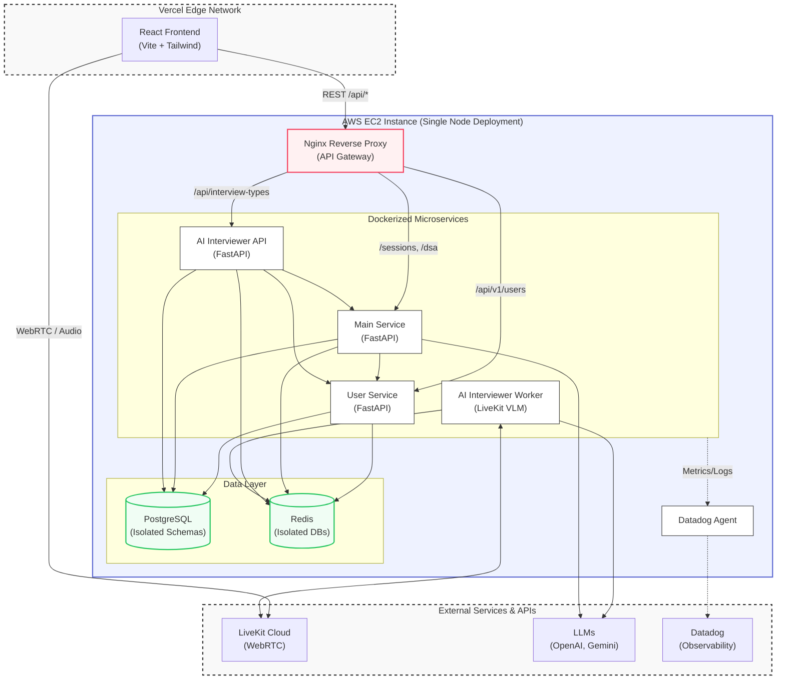

# ThinkAloud AI Backend

ThinkAloud AI is an AI-powered interview preparation platform for coding practice,
system design practice, roadmaps, and real-time mock interviews. The frontend is a
React application deployed separately on Vercel. This repository contains the
backend deployment stack and the backend microservices.

## High-Level Architecture

The backend is split into three services:

1. **User Service**
   - Owns authentication, users, profiles, learning progress, and user-related
     events.
   - Publishes or consumes user lifecycle events where needed.

2. **Main Service**
   - Owns chat assistant workflows, DSA questions, roadmaps, system design flows,
     and code execution integrations.
   - Talks to the user service for authenticated user context.

3. **AI Interviewer Service**
   - Owns AI mock interview APIs and the realtime interview worker.
   - Integrates with LiveKit for realtime audio/video interview sessions.
   - Talks to the user service for authentication and to the main service when
     interview flows need shared platform context.

## Deployment Model

For the sake of deployment simplicity, the complete backend is deployed on a
single VM. Each backend component still runs in its own container, so the system
keeps clear service boundaries while avoiding the operational overhead of a full
Kubernetes or multi-host setup.

The production Docker Compose stack runs:

- `nginx` - public HTTP/HTTPS reverse proxy and API Gateway
- `postgres` - one shared PostgreSQL server
- `redis` - one shared Redis server
- `datadog-agent` - logs, metrics, and APM collection
- `user-service` - user/auth/profile service
- `main-service` - chat, DSA, roadmap, and system design service
- `ai-interviewer-api` - interview API and LiveKit token service
- `ai-interviewer-worker` - realtime AI interviewer worker

PostgreSQL uses one database per service:

- `user_service`
- `main_service`
- `interviewer_service`

Redis uses one logical DB per service:

- DB `0` - user service
- DB `1` - main service
- DB `2` - AI interviewer service

## Request Flow



## Backend Layout

```text
Backend/
  Scalable_User_Service/   # User service
  main_service/            # Chat, DSA, roadmap, system design service
  AI_Interviewer/          # Interview API and realtime worker
  nginx.conf               # Nginx reverse proxy routes
  docker-compose.yml       # Complete EC2 production backend stack
  docker-compose.infra.yml # Local infra-only compose
  init-databases.sql       # Creates per-service Postgres databases
  DEPLOYMENT.md            # Deployment commands and operations notes
```

## Environment Files

Real secrets are not committed. Use the example files as templates:

```bash
Backend/.env.example
Backend/Scalable_User_Service/.env.example
Backend/AI_Interviewer/.env.example
```

For deployment, create one root backend env file:

```bash
cd Backend
cp .env.example .env
```

Then set production values for database password, JWT secret, AI provider keys,
LiveKit keys, frontend URL, CORS origins, and Datadog.

## Deploying on a VM

Install Docker and Docker Compose on the VM, clone the repository, configure
`Backend/.env`, then run:

```bash
cd Backend
docker compose --env-file .env config --quiet
docker compose up -d --build
```

Check status:

```bash
docker compose ps
docker compose logs -f user-service main-service ai-interviewer-api
```

Default exposed app ports:

- `80` - Nginx HTTP
- `443` - Nginx HTTPS
- `8000` - user service, bound to `127.0.0.1`
- `8001` - main service, bound to `127.0.0.1`
- `8002` - AI interviewer API, bound to `127.0.0.1`

Postgres, Redis, and Datadog agent ports are bound to `127.0.0.1` by default and
should not be opened publicly.

## Frontend

The frontend is intentionally deployed separately on Vercel and is not pushed in
this backend deployment repository. Configure the frontend to call the deployed
backend URLs, and configure backend `CORS_ALLOWED_ORIGINS` with the Vercel
frontend domain.

For production, point a DNS record such as `api.thinkaloudai.tech` to the EC2
public IP and set the Vercel frontend variables to HTTPS:

```env
VITE_USER_SERVICE_URL=https://api.thinkaloudai.tech
VITE_MAIN_SERVICE_URL=https://api.thinkaloudai.tech
VITE_AI_SERVICE_URL=https://api.thinkaloudai.tech
```

The frontend must not call `http://<EC2_PUBLIC_IP>:8000` from an HTTPS page,
because browsers block that as mixed content.

## Updating Production

```bash
git pull
cd Backend
docker compose up -d --build
docker compose ps
```

For more details, see [Backend/DEPLOYMENT.md](Backend/DEPLOYMENT.md).
