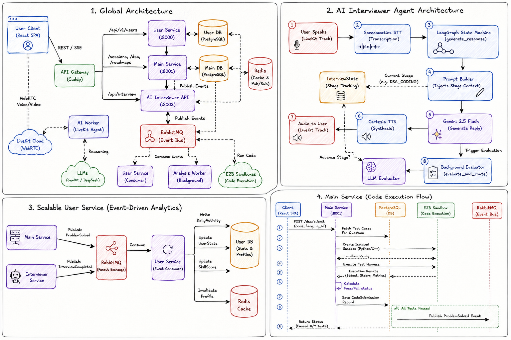

<div align="center">
  

  <h3>🎙️ AI-Powered Mock Interview Platform</h3>
  <p>Real-time voice interviews · Live code editor · Instant AI feedback</p>

  <br/>

  
  
  
  
  
  
  
  
  
  

</div>

<br/>

## ✨ What is ThinkAloud AI?

A platform where an **AI interviewer talks to you in real-time** — just like a real phone screen. It listens to your voice, watches your code, evaluates your approach, and gives detailed post-interview analysis.

| Feature | Description |
|---|---|
| 🎤 **Voice-to-Voice AI** | Real-time conversational interviewer via WebRTC (< 900ms latency) |
| 💻 **Live Code Editor** | Monaco-based editor with syntax highlighting, code execution & test cases |
| 🧠 **LangGraph State Machine** | Multi-stage interview flow (intro → approach → coding → testing → wrap-up) |
| 🎨 **Excalidraw Canvas** | Built-in whiteboard for System Design interviews |
| 📊 **AI Analysis Dashboard** | Post-interview scores, strengths, weaknesses & improvement plans |
| 🔐 **Auth & Profiles** | JWT authentication, user stats, skill tracking & activity heatmaps |

<br/>

## 🏗️ System Architecture

<div align="center">
  
</div>

<br/>

## 🧩 Microservices Breakdown

The backend is split into **three independent services** for scalability and fault isolation:

| Service | Port | Stack | Responsibility |
|---|---|---|---|
| 🔐 **User Service** | `8000` | FastAPI · PostgreSQL · JWT | Auth, profiles, session management |
| ⚙️ **Main Service** | `8001` | FastAPI · PostgreSQL · Redis · RabbitMQ | DSA questions, code execution, progress tracking |
| 🤖 **AI Interviewer** | `8002` | LiveKit Agents · LangGraph · Speechmatics · Cartesia | Real-time voice AI, interview state machine |

<br/>

## 🔊 Voice AI Pipeline

The core innovation — how a user's voice becomes an AI response in under 500ms:

```
🎤 User Speaks
    │
    ▼
┌──────────────────┐
│  LiveKit (WebRTC) │  ← UDP, not TCP — no head-of-line blocking
└────────┬─────────┘
         ▼
┌──────────────────┐
│ Speechmatics STT │  ← Real-time transcription
└────────┬─────────┘
         ▼
┌──────────────────┐
│ LangGraph + LLM  │  ← State-aware response (Gemini / Fireworks)
└────────┬─────────┘
         ▼
┌──────────────────┐
│  Cartesia TTS    │  ← Streaming speech synthesis
└────────┬─────────┘
         ▼
    🔈 AI Responds
```

<br/>

## 🛠️ Key Design Decisions

| Decision | Why |
|---|---|
| **FastAPI + Async** | I/O-bound system (DB, LLM calls, WebSockets) — async prevents thread blocking |
| **WebRTC over WebSockets** | WebRTC uses UDP for media; WebSockets use TCP which suffers from head-of-line blocking |
| **Microservices** | AI worker is CPU-heavy; isolating it prevents auth/CRUD services from degrading |
| **Connection Pooling** | AsyncPG pool avoids opening a new TCP connection per request — critical under load |
| **JWT (Stateless Auth)** | No DB lookup per request; background workers validate tokens independently |
| **RabbitMQ** | Decouples heavy tasks (post-interview analysis) from the request lifecycle |
| **LangGraph State Machine** | Deterministic interview flow with an LLM evaluator that controls stage transitions |

<br/>

## ⚡ Quick Start

```bash
# Clone
git clone https://github.com/itsVish16/ThinkAloudAI.git
cd ThinkAloudAI

# Backend (Docker)
cd Backend
cp .env.example .env        # fill in your API keys
docker compose up -d

# Frontend
cd ../Frontend/AI_Interview_frontend
npm install && npm run dev
```

<br/>

## ⚠️ Known Limitations

| Area | Issue | Mitigation |
|---|---|---|
| 🌐 **WebRTC** | Corporate firewalls block UDP → falls back to TCP TURN | Configurable TURN servers |
| 🗄️ **Database** | Single PostgreSQL instance = single point of failure | Future: read replicas |
| 🔗 **External APIs** | LLM/TTS providers can rate-limit or go down | Provider fallback chain (Gemini → Fireworks → OpenAI) |

<br/>

## 📁 Project Structure

```
ThinkAloudAI/
├── Frontend/
│   └── AI_Interview_frontend/     # React + Vite + TypeScript
│
├── Backend/
│   ├── Scalable_User_Service/     # Auth & user management
│   ├── main_service/              # Core business logic & DSA
│   ├── AI_Interviewer/            # Voice AI agent (LiveKit + LangGraph)
│   ├── docker-compose.yml         # Full stack orchestration
│   └── Caddyfile                  # Reverse proxy config
│
└── System_design.png              # Architecture diagram
```

<br/>

<div align="center">
  <sub>Built with ❤️ by <a href="https://github.com/itsVish16">Vishal</a></sub>
</div>
