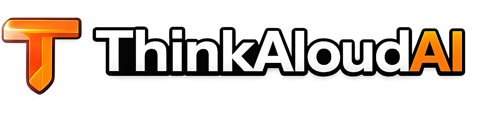

<div align="center">
  

  <h1 align="center">ThinkAloud AI</h1>

  <p align="center">
    <strong>An AI-powered technical interview platform with real-time voice, code execution, and adaptive roadmaps.</strong>
  </p>

  <p align="center">
    <a href="https://github.com/yourusername/ThinkAloudAI/network/members">
      
    </a>
    <a href="https://github.com/yourusername/ThinkAloudAI/stargazers">
      
    </a>
    <a href="https://github.com/yourusername/ThinkAloudAI/blob/main/LICENSE">
      
    </a>
  </p>
</div>

---

## 🚀 What is ThinkAloud AI?

ThinkAloud AI simulates real technical interviews using **live voice conversation** with an AI interviewer powered by Large Language Models (Gemini / DeepSeek). Unlike static coding platforms, ThinkAloud requires you to speak your thought process out loud, just like a real interview.

The platform guides you through the complete interview loop:
* **Real-time Voice Interactions:** WebRTC audio streaming allows for fluid, two-way conversations with the AI interviewer, which adapts to your answers.
* **Live Code Execution:** Write Python or C++ in sandboxed environments while the AI watches and evaluates your code against hidden test cases.
* **Whiteboard System Design:** Built-in Excalidraw integration for architectural design interviews.
* **Structured Feedback:** Post-interview analysis grades you on Technical skill, Communication, and English fluency using the STAR method.
* **AI Chat & Roadmaps:** A built-in AI assistant can search the web, fetch DSA questions, and generate personalized, multi-day study roadmaps.

## 🧠 How It Works

ThinkAloud AI relies on a highly concurrent, event-driven state machine to manage the complexity of live voice interviews:

1. **Audio Streaming:** The candidate's microphone audio is streamed to the backend via **LiveKit (WebRTC)**.
2. **Transcription & VAD:** Audio is transcribed in real-time. Voice Activity Detection (VAD) handles interruptions and silence timeouts.
3. **LangGraph State Machine:** The AI interviewer's logic is governed by **LangGraph**. The interview moves deterministically through predefined stages (e.g., *Intro -> Approach -> Coding -> Testing*).
4. **LLM Evaluation:** A background LLM evaluator runs after every turn to decide if the candidate has met the objective of the current stage before advancing.
5. **Code Execution:** When the candidate hits "Run", the code is dispatched to **E2B Sandboxes** for secure remote execution.
6. **Analytics Sync:** Upon completion, a RabbitMQ event is published. A background worker generates deep feedback, while the User Service updates the candidate's gamified profile (streaks, scores, and leaderboards).

## 🏗️ System Architecture

ThinkAloud AI is designed for scale using an event-driven Microservices architecture:

* **React Frontend:** A Vite-powered SPA utilizing Tailwind CSS, LiveKit React SDK, and Monaco Editor.
* **Caddy API Gateway:** Routes all inbound traffic to the appropriate microservices.
* **AI Interviewer Service (Port 8002):** The core engine. It manages LiveKit WebRTC tokens, runs the LangGraph state machine, and streams audio responses via Cartesia TTS.
* **Main Service (Port 8001):** Manages the DSA question banks, secure E2B code execution, roadmap CRUD, and the ReAct AI Chat Assistant.
* **Scalable User Service (Port 8000):** Manages JWT Authentication, User Profiles, and gamification metrics.
* **Data Layer:** Three isolated **PostgreSQL** databases, **Redis** (for pub/sub streaming and caching), and **RabbitMQ** (for durable background event processing).

> **Visual Diagrams:** Detailed Excalidraw-compatible system architecture diagrams are available in the project documentation.

## 🛠️ Tech Stack

* **Frontend:** React 18, Vite, Tailwind CSS, Monaco Editor, Excalidraw, LiveKit
* **Backend:** Python 3.12, FastAPI, SQLAlchemy 2.0 (Async), LangGraph, E2B
* **AI & Voice:** Google Gemini 2.5, DeepSeek, Cartesia TTS, Speechmatics STT
* **Infrastructure:** PostgreSQL 16, Redis 7, RabbitMQ 3, Docker Compose

---

## 💻 Getting Started

To get a local copy up and running, follow these simple steps.

### Prerequisites

You will need Docker and Docker Compose installed on your system.

### Installation

1. **Clone the repo**
   ```sh
   git clone https://github.com/yourusername/ThinkAloudAI.git
   cd ThinkAloudAI
   ```
2. **Setup Environment Variables**
   ```sh
   cd Backend
   cp .env.example .env
   # Edit .env with your LiveKit, LLM, and API keys.
   ```
3. **Start the Infrastructure (Databases)**
   ```sh
   docker compose -f docker-compose.infra.yml up -d
   ```
4. **Run the Application Services**
   ```sh
   docker compose up -d --build
   ```
5. **Start the Frontend**
   ```sh
   cd ../Frontend/AI_Interview_frontend
   npm install
   npm run dev
   ```

---

## 📄 License

Distributed under the MIT License. See `LICENSE` for more information.
