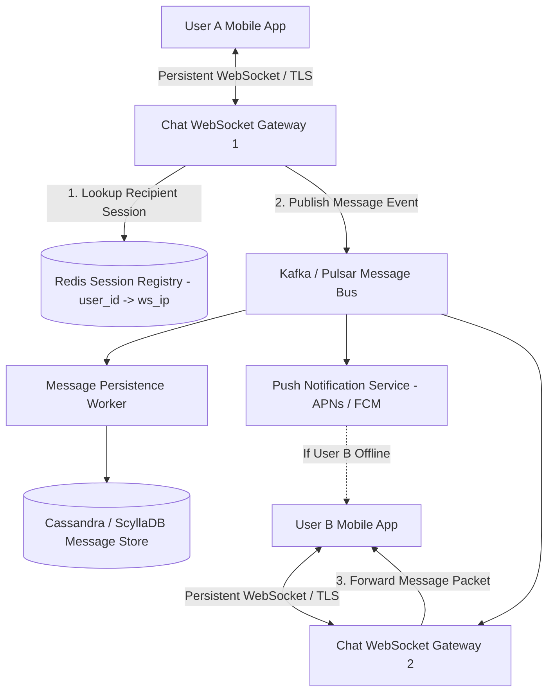
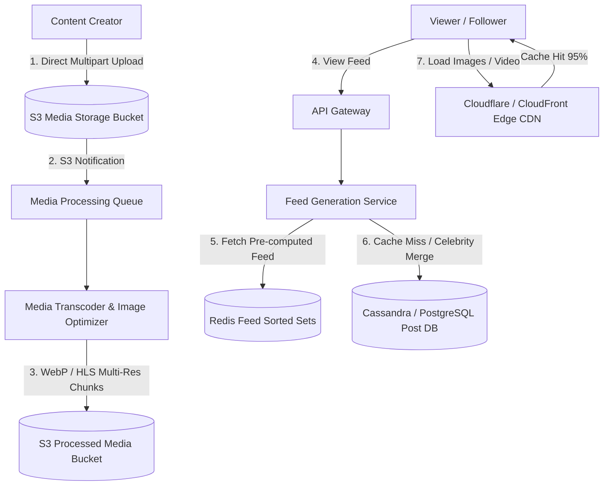
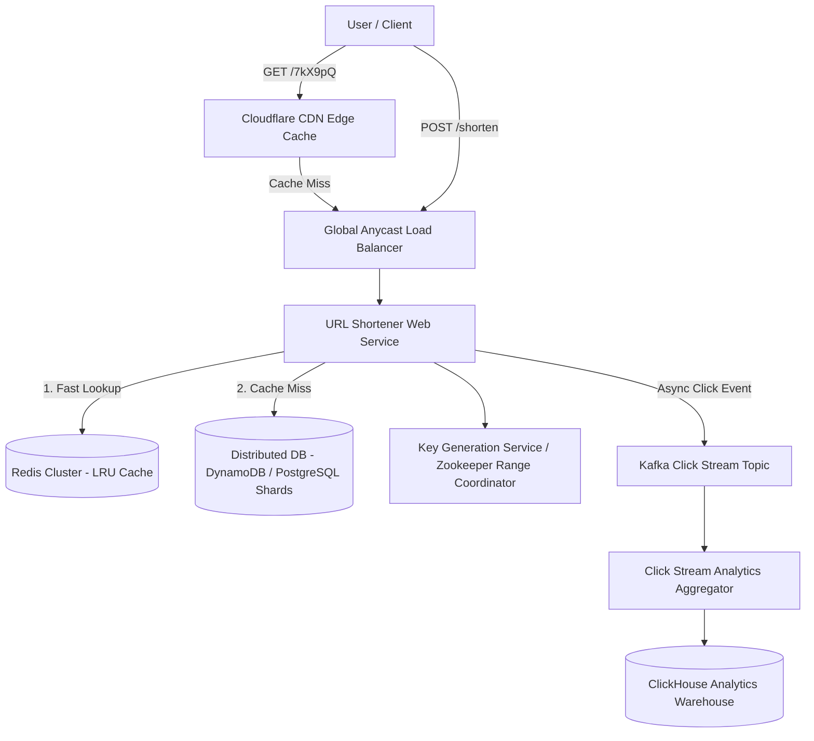
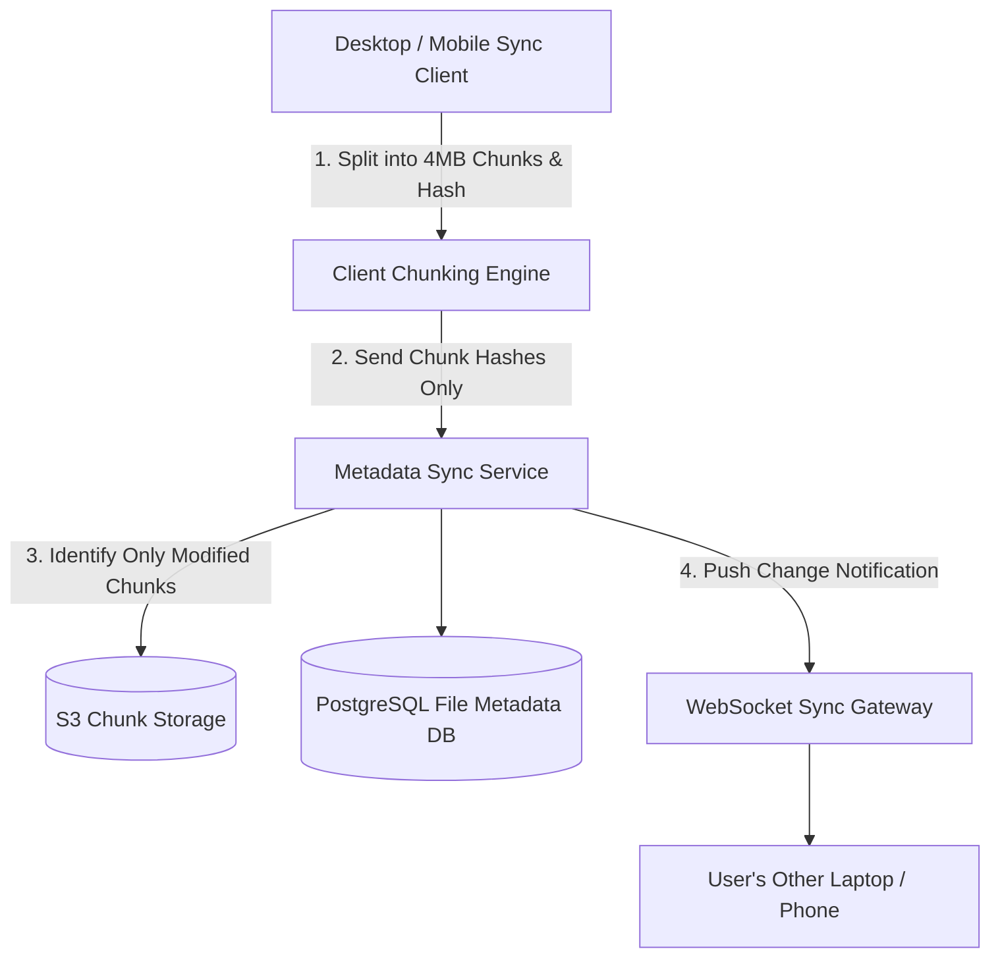
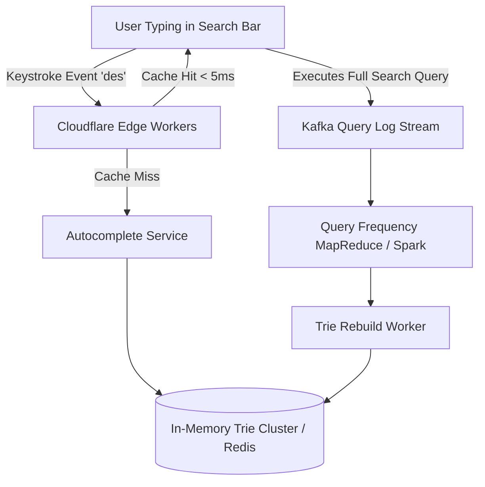

# 🏛️ Master High-Level Design (HLD) Interview Handbook & Architecture Blueprints

> Comprehensive technical reference containing industry-standard product blueprints (Rate Limiter, WhatsApp, Zomato/Swiggy, Uber, Instagram, YouTube, BookMyShow, Stripe, TinyURL, Google Drive, Search Typeahead, and RAG/LLM Serving) complete with capacity estimations, Mermaid component diagrams, database schemas, step-by-step request workflows, and deep-dive trade-offs.

## 📐 The 5-Step System Design Interview Framework

| Step | Phase | Duration | Core Objectives |
|---|---|---|---|
| **1** | **Scope & Requirements Clarification** | 3–5 mins | Define Functional vs Non-Functional requirements, API endpoints, traffic scale, and out-of-scope boundaries. |
| **2** | **Back-of-the-Envelope Calculations** | 3–5 mins | Estimate Peak QPS, Read/Write ratio, 5-year storage, network bandwidth, and in-memory cache capacity. |
| **3** | **High-Level System Architecture** | 10–15 mins | Draw end-to-end component flow (Clients $\rightarrow$ CDN $\rightarrow$ LB $\rightarrow$ Gateway $\rightarrow$ Services $\rightarrow$ Cache $\rightarrow$ DB $\rightarrow$ Queues $\rightarrow$ Workers). |
| **4** | **Data Model & Schema Design** | 5–8 mins | Choose SQL vs NoSQL, define tables, primary keys, indexing strategies, and sharding keys. |
| **5** | **Deep Dive & Bottleneck Mitigations** | 15–20 mins | Address race conditions, caching strategies, replication, single points of failure (SPOF), and disaster recovery. |

---

## 📑 Table of Contents


### 📁 Core Infrastructure & Security

1. [Design a Distributed Rate Limiter (Cloudflare / AWS WAF)](#hld-1) — *Cloudflare / AWS WAF / Stripe API Gateway* (`Medium`)

### 📁 Real-Time Systems & Instant Messaging

2. [Design WhatsApp / Messenger (Real-Time Chat)](#hld-2) — *WhatsApp / Signal / Discord / Telegram* (`Hard`)

### 📁 Real-Time Geospatial & E-Commerce

3. [Design Zomato / Swiggy / DoorDash (Food Delivery Platform)](#hld-3) — *Zomato / Swiggy / DoorDash / Uber Eats* (`Hard`)

### 📁 Real-Time Geospatial & Dispatch Systems

4. [Design Uber / Lyft (Ride-Hailing & Real-Time Dispatch)](#hld-4) — *Uber / Lyft / Ola / Grab* (`Hard`)

### 📁 High-Scale Media & Content Sharing

5. [Design Instagram / TikTok (Photo & Video Social Platform)](#hld-5) — *Instagram / TikTok / Pinterest* (`Hard`)
6. [Design YouTube / Netflix (Global Video Streaming Platform)](#hld-6) — *YouTube / Netflix / Disney+ / Twitch* (`Hard`)

### 📁 High-Concurrency Transactional Systems

7. [Design BookMyShow / Ticketmaster (Concert & Movie Ticket Booking)](#hld-7) — *BookMyShow / Ticketmaster / Eventbrite* (`Hard`)
8. [Design Stripe / PayPal (Payment Gateway & Double-Entry Ledger)](#hld-8) — *Stripe / PayPal / Google Pay / Razorpay* (`Hard`)

### 📁 Core Infrastructure & Security

9. [Design a URL Shortener (TinyURL / Bit.ly)](#hld-9) — *TinyURL / Bitly / Dub.co* (`Easy - Medium`)

### 📁 Storage, Observability & Cloud Systems

10. [Design Google Drive / Dropbox (Cloud File Storage & Sync)](#hld-10) — *Google Drive / Dropbox / Box / iCloud* (`Hard`)

### 📁 Search & Information Retrieval

11. [Design Search Autocomplete / Typeahead (Google Search)](#hld-11) — *Google Search / Amazon Search Bar* (`Medium`)

### 📁 AI/ML Infrastructure

12. [Design an LLM & RAG Serving Architecture (vLLM / Vector DB)](#hld-12) — *ChatGPT / Perplexity / Claude / Cursor* (`Hard`)

---

## <a id="hld-1"></a> 1. Design a Distributed Rate Limiter (Cloudflare / AWS WAF)

- **Target Product Archetype:** `Cloudflare / AWS WAF / Stripe API Gateway`
- **Category:** Core Infrastructure & Security
- **Difficulty Rating:** `Medium`
- **Target Engineering Role:** Software Engineer / Senior Backend Engineer

> **Executive Summary:** Design a distributed, low-latency API Rate Limiter to protect microservices from API abuse, volumetric DDoS attacks, brute-force requests, and resource exhaustion.

### 1. Requirements & System Scope

**Functional Requirements:**
- Limit requests based on Client IP, User ID, or API Key (e.g., 100 requests per minute per IP).
- Return HTTP 429 (Too Many Requests) with standard headers (`X-RateLimit-Limit`, `X-RateLimit-Remaining`, `Retry-After`).
- Support tiered rate limits for different user tiers (Free vs Tier 1 vs Enterprise) and endpoint-specific rules.

**Non-Functional Requirements:**
- Sub-millisecond processing latency (< 1ms P99 overhead per check).
- High availability with graceful fail-open fallback if rate limiting cluster degrades.
- Accurate distributed tracking across multi-region edge gateways.
- Low memory footprint across millions of active clients.

### 2. Capacity & Back-of-the-Envelope Estimations

- **Total Traffic:** 100,000 API requests/sec peak across global gateways.
- **Active Clients:** 10M active API keys/day.
- **Memory Footprint:** 10M keys * 64 bytes per Redis token bucket state = **~640 MB RAM** (fits easily in in-memory Redis cluster).
- **Network Bandwidth:** Rate check payload ~100 bytes * 100k QPS = **10 MB/sec**.

### 3. High-Level System Architecture (HLD)

```mermaid
flowchart TD
    Client[Client / Mobile App] -->|HTTP Request| CDN[Cloudflare CDN / Edge WAF]
    CDN --> LB[Global Load Balancer]
    LB --> Gateway[API Gateway / Envoy Reverse Proxy]
    
    Gateway -->|1. Run Rate Check Lua Script| RedisCluster[(Redis Cluster - Multi-Replica)]
    RedisCluster -->|2. Allowed (Tokens Remaining: 84)| Gateway
    Gateway -->|3. Forward Request| Backend[Backend Microservices]
    
    Gateway -.->|Tokens Depleted| 429Err[HTTP 429 Too Many Requests]
    Gateway -.->|Redis Timeout Fallback| FailOpen[Fail-Open: Forward & Alert Datadog]
```

### 4. Data Model & Database Design

### In-Memory Storage Model (Redis)

**1. Token Bucket Redis Hash:**
```redis
HSET ratelimit:user_1024 tokens 95 last_refill 1718901234
EXPIRE ratelimit:user_1024 3600
```

**2. Sliding Window Log in Redis Sorted Set (ZSET):**
```redis
ZADD ratelimit:ip_192.168.1.1 1718901234.500 "req_uuid_abc"
ZREMRANGEBYSCORE ratelimit:ip_192.168.1.1 -inf (current_time - 60)
ZCARD ratelimit:ip_192.168.1.1
```

### Deep Dive & Engineering Trade-offs:
1. **Algorithm Comparison:**
   - **Token Bucket (Standard):** Supports bursts up to bucket capacity; memory efficient $O(1)$.
   - **Sliding Window Counter:** Blends rolling window accuracy with low memory, eliminating boundary burst vulnerabilities.
2. **Concurrency & Race Conditions:**
   - Multiple concurrent requests from the same user hitting different gateways cause read-modify-write races.
   - **Solution:** Execute rate-limiting logic inside Redis using **atomic Lua scripts** (`evalsha`), leveraging Redis single-threaded execution guarantees.
3. **Multi-Region Synchronization:**
   - Use local edge caches with centralized asynchronous Redis replication, or use consistent hashing to pin client IPs to specific regional gateway clusters.

---

## <a id="hld-2"></a> 2. Design WhatsApp / Messenger (Real-Time Chat)

- **Target Product Archetype:** `WhatsApp / Signal / Discord / Telegram`
- **Category:** Real-Time Systems & Instant Messaging
- **Difficulty Rating:** `Hard`
- **Target Engineering Role:** Senior Software Engineer / Distributed Systems SWE

> **Executive Summary:** Design an end-to-end encrypted, real-time messaging system supporting 1-on-1 chats, group chats, message delivery receipts, online presence, and offline sync.

### 1. Requirements & System Scope

**Functional Requirements:**
- 1-on-1 direct messaging and group chats (up to 1,000 members).
- Real-time message delivery receipts (Sent ✓, Delivered ✓✓, Read 🔵🔵).
- Online / offline presence tracking and typing indicators.
- Media sharing (photos, audio notes, video, documents).
- Automatic offline message queuing and synchronization upon reconnect.

**Non-Functional Requirements:**
- Real-time delivery latency (< 100ms P99).
- Zero message loss (At-least-once delivery with client-side deduplication).
- Guaranteed message ordering within individual conversations.
- High scalability: 500M Daily Active Users and 50M concurrent WebSocket connections.

### 2. Capacity & Back-of-the-Envelope Estimations

- **Daily Active Users (DAU):** 500M users.
- **Message Volume:** 500M * 100 messages/day = **50B messages/day $\rightarrow$ ~600,000 messages/sec peak**.
- **Concurrent Connections:** **50M persistent WebSocket connections**.
- **Daily Storage:** 50B msgs * 200 bytes = **10 TB/day text**; Media = **5 PB/day S3 storage**.

### 3. High-Level System Architecture (HLD)



### 4. Data Model & Database Design

### Cassandra / ScyllaDB Schema (Optimized for Fast Sequential Reads)

```sql
CREATE TABLE messages (
    conversation_id UUID,
    message_id TIMEUUID,                  -- Encodes millisecond timestamp & ensures chronological sorting
    sender_id UUID,
    content TEXT,
    media_url TEXT,
    delivery_status VARCHAR(10),          -- SENT, DELIVERED, READ
    created_at TIMESTAMP,
    PRIMARY KEY ((conversation_id), message_id)
) WITH CLUSTERING ORDER BY (message_id DESC);
```

### Deep Dive & Technical Challenges:
1. **Handling 50M Open WebSocket Connections:**
   - Linux epoll servers (Go / Netty / Rust) handle 50,000–100,000 idle TCP connections per server.
   - 50M connections $\rightarrow$ fleet of ~500–1,000 WebSocket gateways managed behind Layer 4 TCP Load Balancers.
2. **Group Chat Fan-out:**
   - For small/medium groups (< 1,000 users): WebSocket server fetches group membership list from Redis and fans out messages to all active member sockets.
   - For massive channels (> 100k users): Use pub/sub topic partitioning and client-side pull models to avoid server memory exhaustion.
3. **End-to-End Encryption (Signal Protocol):**
   - Server only relays encrypted ciphertexts and public pre-keys; servers have zero visibility into plaintext content.

---

## <a id="hld-3"></a> 3. Design Zomato / Swiggy / DoorDash (Food Delivery Platform)

- **Target Product Archetype:** `Zomato / Swiggy / DoorDash / Uber Eats`
- **Category:** Real-Time Geospatial & E-Commerce
- **Difficulty Rating:** `Hard`
- **Target Engineering Role:** Senior Software Engineer / Staff Architect

> **Executive Summary:** Design a high-scale food delivery platform connecting customers, restaurants, and delivery drivers with real-time dispatch, live GPS order tracking, and inventory management.

### 1. Requirements & System Scope

**Functional Requirements:**
- Restaurant & Menu Discovery: Search nearby restaurants by location, cuisine, ratings, and dietary preferences.
- Cart & Checkout: Add items, apply promo coupons, and complete payment.
- Order State Machine: Real-time status transitions (`PLACED -> RESTAURANT_ACCEPTED -> FOOD_PREPARING -> DRIVER_ASSIGNED -> OUT_FOR_DELIVERY -> DELIVERED`).
- Driver Dispatch & Matching: Real-time matching of optimal delivery partner based on proximity, traffic, and restaurant preparation time.
- Live Delivery Tracking: Stream live delivery partner GPS location on map with sub-second ETA updates.

**Non-Functional Requirements:**
- Real-time location tracking updates (< 2 seconds latency).
- Zero double-ordering or race conditions during inventory decrement.
- High availability (99.99%) especially during lunch/dinner peak meal spikes.
- Resilience against sudden network dropouts on driver mobile devices.

### 2. Capacity & Back-of-the-Envelope Estimations

- **Daily Orders:** 5M orders/day (Peak lunch/dinner: 2,000 orders/second).
- **Active Delivery Partners:** 200,000 active drivers sending GPS coordinates every 4s $\rightarrow$ **50,000 location updates/sec**.
- **Read Traffic (Menu Browsing):** 50,000 search/menu views/sec.

### 3. High-Level System Architecture (HLD)

```mermaid
flowchart TD
    Customer[Customer App] -->|1. Search / Place Order| LB[Load Balancer]
    LB --> Gateway[API Gateway]
    
    Gateway --> RestaurantService[Restaurant & Menu Service]
    RestaurantService --> ElasticSearch[(ElasticSearch / PostGIS)]
    
    Gateway --> OrderService[Order Management Service]
    OrderService --> OrderDB[(PostgreSQL Primary DB)]
    OrderService -->|2. Order Placed Event| Kafka[Kafka Order Events Topic]
    
    Kafka --> RestaurantGateway[Restaurant Partner Tablet App]
    Kafka --> DispatchEngine[Driver Dispatch & Matching Engine]
    
    Driver[Delivery Driver App] -->|3. GPS ping every 4s (gRPC/UDP)| LocationService[Location Ingestion Gateway]
    LocationService --> RedisGeo[(Redis H3 Geospatial Grid)]
    
    DispatchEngine -->|4. Match Optimal Driver| RedisGeo
    DispatchEngine -->|5. Push Order Offer| Driver
    
    Driver -->|6. Stream GPS| TrackingService[Live Order Tracking Service]
    TrackingService -->|WebSocket Live Map Stream| Customer
```

### 4. Data Model & Database Design

### Relational Database Schema (PostgreSQL with PostGIS)

```sql
-- Orders Table
CREATE TABLE orders (
    id UUID PRIMARY KEY DEFAULT gen_random_uuid(),
    customer_id UUID NOT NULL,
    restaurant_id UUID NOT NULL,
    driver_id UUID NULL,
    total_amount DECIMAL(10, 2) NOT NULL,
    status VARCHAR(30) NOT NULL, -- PLACED, ACCEPTED, PREPARING, PICKED_UP, DELIVERED, CANCELLED
    delivery_lat DECIMAL(9, 6),
    delivery_lon DECIMAL(9, 6),
    created_at TIMESTAMP WITH TIME ZONE DEFAULT NOW()
);
CREATE INDEX idx_orders_customer ON orders(customer_id, created_at DESC);
```

### Deep Dive & Core Engineering Challenges:
1. **Dispatch Optimization & Batching (Order Pooling):**
   - If two customers living in the same apartment complex order from neighboring restaurants within 5 minutes, the Dispatch Engine batches both deliveries to a single driver, cutting delivery costs by 40%.
2. **Preventing Driver Double-Assignment:**
   - When offering an order to a driver, acquire an atomic Redis lock (`SET driver:lock:id token NX EX 30`).
   - Transitioning order state uses optimistic database locking (`UPDATE orders SET driver_id = :id WHERE id = :order_id AND driver_id IS NULL`).
3. **Handling Peak Lunch/Dinner Spikes:**
   - Menu viewing is 95% read-heavy: cached aggressively in Redis / Cloudflare Edge CDN.
   - Order placement enters Kafka queue for buffered asynchronous ingestion to protect primary transactional databases.

---

## <a id="hld-4"></a> 4. Design Uber / Lyft (Ride-Hailing & Real-Time Dispatch)

- **Target Product Archetype:** `Uber / Lyft / Ola / Grab`
- **Category:** Real-Time Geospatial & Dispatch Systems
- **Difficulty Rating:** `Hard`
- **Target Engineering Role:** Staff Software Engineer / Principal Architect

> **Executive Summary:** Design a real-time ride-hailing and dispatch system matching riders with nearby drivers in sub-seconds with dynamic surge pricing and live trip tracking.

### 1. Requirements & System Scope

**Functional Requirements:**
- Drivers stream live GPS locations every 4 seconds.
- Riders request rides specifying pickup and dropoff coordinates.
- Match riders with the optimal nearby driver in sub-seconds.
- Live trip tracking, dynamic route navigation, and real-time ETA calculation.
- Dynamic surge pricing based on local supply/demand density.

**Non-Functional Requirements:**
- Ultra-low latency driver matchmaking (< 1 second).
- Real-time driver location updates (< 1s staleness).
- Zero double-dispatch race conditions (no two riders assigned to the same driver).
- High availability across global metropolitan areas.

### 2. Capacity & Back-of-the-Envelope Estimations

- **Active Drivers:** 2M active drivers sending GPS every 4s $\rightarrow$ **500,000 location updates/sec**.
- **Ride Requests:** 50,000 ride requests/sec peak.
- **Geospatial Memory:** 2M drivers * 100 bytes state in Redis = **~200 MB RAM** (extremely compact; partitioned by city).

### 3. High-Level System Architecture (HLD)

```mermaid
flowchart TD
    Driver[Driver Mobile App] -->|GPS updates every 4s (gRPC / UDP)| IngestGateway[Location Ingestion Gateway]
    IngestGateway --> RedisH3[(Redis Geospatial H3 / Ring Buffer)]
    
    Rider[Rider Mobile App] -->|1. Request Ride| DispatchService[Dispatch & Matching Engine]
    
    DispatchService -->|2. Query Nearby Drivers in H3 Cell| RedisH3
    DispatchService -->|3. Calculate ETA & Route| RoutingEngine[Routing & ETA Engine (OSRM / GraphHopper)]
    DispatchService -->|4. Compute Surge Multiplier| SurgePricing[Surge Pricing Service]
    
    DispatchService -->|5. Atomic Driver Reservation via Redlock| Lock[(Distributed Lock)]
    DispatchService -->|6. Offer Ride| Driver
    
    Driver -->|7. Accept Ride| TripService[Trip Management Service]
    TripService --> TripDB[(PostgreSQL Trip DB)]
    TripService -->|Live Trip WebSocket Stream| Rider
```

### 4. Data Model & Database Design

### Geospatial Partitioning Model (Uber H3 Indexing)
- Earth surface partitioned into hierarchical hexagonal cells (H3 Resolution 8 $\approx$ 460m radius).
- **Redis H3 Set:** Key `h3:cell:8828308281fffff` $\rightarrow$ Set of active `driver_ids`.

```sql
CREATE TABLE trips (
    id UUID PRIMARY KEY DEFAULT gen_random_uuid(),
    rider_id UUID NOT NULL,
    driver_id UUID NULL,
    status VARCHAR(20) NOT NULL, -- REQUESTED, MATCHED, ARRIVED, IN_PROGRESS, COMPLETED
    pickup_lat DECIMAL(9, 6),
    pickup_lon DECIMAL(9, 6),
    dropoff_lat DECIMAL(9, 6),
    dropoff_lon DECIMAL(9, 6),
    surge_multiplier DECIMAL(3, 2) DEFAULT 1.0,
    fare_amount DECIMAL(10, 2),
    created_at TIMESTAMP WITH TIME ZONE DEFAULT NOW()
);
```

### Deep Dive & Critical Engineering Highlights:
1. **Why Hexagons (H3) vs Squares (Geohash):**
   - In a square grid, diagonal neighbors are $\sqrt{2}$ times farther than orthogonal neighbors.
   - In a hexagonal grid (H3), all 6 neighboring cells are equidistant, simplifying radius expansions and smoothing search algorithms.
2. **Handling Driver Rejection / Timeout:**
   - If driver rejects or timer expires (15s), release Redis lock, mark driver as temporarily skipped for this trip, and immediately cascade offer to the 2nd best driver in the candidate queue.

---

## <a id="hld-5"></a> 5. Design Instagram / TikTok (Photo & Video Social Platform)

- **Target Product Archetype:** `Instagram / TikTok / Pinterest`
- **Category:** High-Scale Media & Content Sharing
- **Difficulty Rating:** `Hard`
- **Target Engineering Role:** Senior Software Engineer / Staff SWE

> **Executive Summary:** Design a high-scale multimedia sharing platform supporting image/video feed generation, 24-hour stories, user follow graphs, and real-time like/comment interactions.

### 1. Requirements & System Scope

**Functional Requirements:**
- Upload photos and short-form videos with captions and tags.
- Personalized chronological / algorithmic Home Feed.
- 24-Hour Stories that automatically expire after 1 day.
- Follow/unfollow users, like posts, and post comments.

**Non-Functional Requirements:**
- Feed rendering latency < 200ms.
- High availability with eventual consistency.
- Scalable media storage with global CDN edge caching.

### 2. Capacity & Back-of-the-Envelope Estimations

- **DAU:** 500M Daily Active Users.
- **Uploads:** 100M media posts/day $\rightarrow$ **~1,200 write QPS**.
- **Feed Views:** 500M * 20 feed views = 10B views/day $\rightarrow$ **~120,000 read QPS** (Read-to-Write ratio: 100:1).
- **Storage:** 100M posts * 2 MB average media = **200 TB/day $\rightarrow$ ~73 PB/year S3 storage**.

### 3. High-Level System Architecture (HLD)



### 4. Data Model & Database Design

```sql
CREATE TABLE posts (
    id UUID PRIMARY KEY DEFAULT gen_random_uuid(),
    user_id UUID NOT NULL,
    media_url TEXT NOT NULL,
    thumbnail_url TEXT NOT NULL,
    caption TEXT,
    likes_count BIGINT DEFAULT 0,
    comments_count BIGINT DEFAULT 0,
    created_at TIMESTAMP WITH TIME ZONE DEFAULT NOW()
);
CREATE INDEX idx_posts_user ON posts(user_id, created_at DESC);
```

### Deep Dive & Optimizations:
1. **The Celebrity Fan-out Dilemma:**
   - Accounts with 50M+ followers cannot fan-out on write (pushing to 50M Redis lists causes huge lag).
   - **Solution:** Hybrid Fanout: Regular users use Fan-out on Write (Push). Celebrities use Fan-out on Read (Pull). When a user opens their feed, the server fetches their push feed from Redis and merges it with the latest posts of celebrities they follow.

---

## <a id="hld-6"></a> 6. Design YouTube / Netflix (Global Video Streaming Platform)

- **Target Product Archetype:** `YouTube / Netflix / Disney+ / Twitch`
- **Category:** High-Scale Media & Content Sharing
- **Difficulty Rating:** `Hard`
- **Target Engineering Role:** Senior SWE / Staff Infrastructure Engineer

> **Executive Summary:** Design a global video ingestion, transcoding, and adaptive bitrate streaming platform supporting billions of daily views.

### 1. Requirements & System Scope

**Functional Requirements:**
- Creators upload raw videos in any format up to 4K resolution.
- Viewers stream video seamlessly with Adaptive Bitrate Streaming (HLS/DASH).
- View counts, likes, comments, and real-time metadata tracking.

**Non-Functional Requirements:**
- Instant playback start (< 500ms initial buffer time).
- Zero buffering during network degradation.
- High durability (zero video file loss across multiple AWS regions).

### 2. Capacity & Back-of-the-Envelope Estimations

- **Uploads:** 500 hours uploaded/min $\rightarrow$ **~2 PB new video storage daily**.
- **Streaming:** 1B daily active users, average 30 mins/day $\rightarrow$ **~50 Tbps peak bandwidth**.

### 3. High-Level System Architecture (HLD)

```mermaid
flowchart TD
    Creator[Content Creator] -->|1. Direct Multipart Upload| S3Raw[(S3 Raw Upload Bucket)]
    S3Raw -->|2. S3 Notification| Kafka[Transcode Task Queue]
    
    Kafka --> TranscodeWorkers[Distributed Transcoding Fleet (GPU Clusters)]
    TranscodeWorkers -->|3. HLS Chunks (1080p, 720p, 480p)| S3Processed[(S3 Processed Video Storage)]
    
    Viewer[Viewer Client] -->|4. Request HLS Stream| CDN[Global Edge CDN (Cloudflare/Fastly)]
    CDN -->|Cache Hit 98%| Viewer
    CDN -->|Cache Miss| S3Processed
    
    Viewer -->|5. View Heartbeat| ViewCounter[Redis HyperLogLog & Aggregator]
    ViewCounter --> VideoDB[(PostgreSQL Primary DB)]
```

### 4. Data Model & Database Design

```sql
CREATE TABLE videos (
    id UUID PRIMARY KEY DEFAULT gen_random_uuid(),
    user_id BIGINT NOT NULL,
    title VARCHAR(255) NOT NULL,
    description TEXT,
    manifest_url TEXT NOT NULL,           -- HLS master playlist .m3u8
    duration_seconds INT NOT NULL,
    views_count BIGINT DEFAULT 0,
    status VARCHAR(20) DEFAULT 'READY'
);
```

### Deep Dive & Video Processing Mechanics:
1. **Adaptive Bitrate Streaming (ABR):**
   - Transcoders slice the video into 2 to 6-second `.ts` segments encoded at varying bitrates (1080p, 720p, 480p, 360p).
   - An `index.m3u8` master playlist lists all stream qualities. The player continuously monitors network throughput and switches bitrates dynamically.

---

## <a id="hld-7"></a> 7. Design BookMyShow / Ticketmaster (Concert & Movie Ticket Booking)

- **Target Product Archetype:** `BookMyShow / Ticketmaster / Eventbrite`
- **Category:** High-Concurrency Transactional Systems
- **Difficulty Rating:** `Hard`
- **Target Engineering Role:** Staff Software Engineer / Transactional Systems Architect

> **Executive Summary:** Design a high-concurrency seat reservation and ticketing engine preventing double-booking during viral concert ticket sales.

### 1. Requirements & System Scope

**Functional Requirements:**
- Browse movies/concerts, venues, showtimes, and interactive seat maps.
- Temporarily lock/reserve chosen seats for 10 minutes during payment.
- Confirm booking upon payment or release locked seats automatically if checkout expires.
- Prevent any seat from being double-booked.

**Non-Functional Requirements:**
- Strict zero double-booking (seat allocation is 100% mutually exclusive).
- High concurrency handling (500,000 users competing for 20,000 stadium seats).
- Idempotent payment capture and atomic inventory release on timeout.

### 2. Capacity & Back-of-the-Envelope Estimations

- **Concert Sale Spike:** 500,000 users hitting 'Reserve Seats' within 10 seconds of tickets opening $\rightarrow$ **50,000 QPS burst**.

### 3. High-Level System Architecture (HLD)

```mermaid
flowchart TD
    User[500,000 Fans] -->|1. Book Seats 12A, 12B| LB[Load Balancer]
    LB --> Gateway[Virtual Waiting Room / Queue-it API Gateway]
    
    Gateway --> BookingService[Seat Reservation Service]
    BookingService -->|2. Atomic Seat Lock Lua Script| RedisSeats[(Redis Seat Lock State - TTL 10m)]
    
    RedisSeats -->|Lock Acquired: Token Issued| BookingService
    RedisSeats -.->|Seat Already Locked / Sold| Reject[Seat Unavailable - Choose Another]
    
    BookingService -->|3. Publish Lock Event| DelayQueue[RabbitMQ / Redis Delayed Exchange (10m TTL)]
    
    BookingService --> PaymentService[Payment Gateway]
    PaymentService -->|4. Payment Success| OrderService[Order Fulfillment Service]
    OrderService --> DB[(PostgreSQL Primary Booking DB)]
    
    DelayQueue -.->|If No Payment in 10m| AutoReleaseWorker[Auto-Release Expired Seats Worker]
    AutoReleaseWorker --> RedisSeats
```

### 4. Data Model & Database Design

```sql
CREATE TABLE show_seats (
    id UUID PRIMARY KEY DEFAULT gen_random_uuid(),
    show_id UUID NOT NULL,
    seat_number VARCHAR(10) NOT NULL,
    status VARCHAR(20) NOT NULL, -- AVAILABLE, LOCKED, BOOKED
    locked_by_user UUID NULL,
    lock_expires_at TIMESTAMP WITH TIME ZONE NULL,
    version INT NOT NULL DEFAULT 0,
    UNIQUE(show_id, seat_number)
);
```

### Deep Dive & Engineering Concurrency:
1. **Preventing Race Conditions (Optimistic vs Pessimistic vs Redis):**
   - Direct database pessimistic locking (`SELECT ... FOR UPDATE`) causes database connection pool exhaustion under 50k QPS.
   - **Solution:** Multi-tier locking: Redis atomic operations filter out 99.9% of redundant competing requests in memory, allowing only winning requests to hit the relational database.

---

## <a id="hld-8"></a> 8. Design Stripe / PayPal (Payment Gateway & Double-Entry Ledger)

- **Target Product Archetype:** `Stripe / PayPal / Google Pay / Razorpay`
- **Category:** High-Concurrency Transactional Systems
- **Difficulty Rating:** `Hard`
- **Target Engineering Role:** Staff Software Engineer / Financial SWE

> **Executive Summary:** Design a financial payment orchestration platform guaranteeing exactly-once transaction execution and mathematical double-entry bookkeeping.

### 1. Requirements & System Scope

**Functional Requirements:**
- Process card/bank payments via third-party PSPs (Visa, Mastercard, Bank Rails).
- Record every monetary transaction in an immutable double-entry ledger.
- Support refunds, chargebacks, and automated daily reconciliation.

**Non-Functional Requirements:**
- 100% financial accuracy (zero double charges, zero lost funds).
- Strict idempotency on all payment API requests.
- Auditability: Immutable, append-only ledger entries.

### 2. Capacity & Back-of-the-Envelope Estimations

- **Scale:** 10,000 payment transactions/second with $99.9999\%$ reliability.

### 3. High-Level System Architecture (HLD)

```mermaid
flowchart TD
    Merchant[Merchant App] -->|POST /v1/charges (Idempotency-Key: abc-123)| Gateway[Payment Gateway]
    Gateway -->|1. Check Idempotency Key| IdempStore[(Redis / PostgreSQL Idempotency Table)]
    
    Gateway -->|2. Execute Payment Saga| PaymentOrchestrator[Payment Orchestrator]
    PaymentOrchestrator -->|3. Call Acquirer / Bank| ThirdPartyBank[External Bank / Visa PSP]
    
    PaymentOrchestrator -->|4. Record Double-Entry Transactions| LedgerService[Ledger Service]
    LedgerService --> LedgerDB[(PostgreSQL Immutable Ledger DB)]
```

### 4. Data Model & Database Design

```sql
-- Double-Entry Ledger Bookkeeping (Total Debits == Total Credits)
CREATE TABLE ledger_entries (
    id UUID PRIMARY KEY DEFAULT gen_random_uuid(),
    transaction_id UUID NOT NULL,
    account_id UUID NOT NULL,
    amount DECIMAL(18, 4) NOT NULL,      -- Positive for Debit, Negative for Credit
    currency VARCHAR(3) NOT NULL,
    created_at TIMESTAMP WITH TIME ZONE DEFAULT NOW()
);
```

### Deep Dive & Financial Safety:
1. **Strict Idempotency via Idempotency Keys:**
   - Client sends unique UUID in `Idempotency-Key` header.
   - Gateway records key in DB before contacting bank. If network drops and client retries, the server returns the cached response instead of charging again.

---

## <a id="hld-9"></a> 9. Design a URL Shortener (TinyURL / Bit.ly)

- **Target Product Archetype:** `TinyURL / Bitly / Dub.co`
- **Category:** Core Infrastructure & Security
- **Difficulty Rating:** `Easy - Medium`
- **Target Engineering Role:** Software Engineer / Senior SWE

> **Executive Summary:** Design a globally distributed URL shortening service converting long URLs into compact 7-character aliases with ultra-fast HTTP redirects.

### 1. Requirements & System Scope

**Functional Requirements:**
- Given a long URL, generate a unique short alias (e.g. `https://tinyurl.com/aB3x9Z`).
- Redirect short URLs to original destination with HTTP 301/302 in under 20ms.
- Support optional custom short aliases and expiration dates.
- Track real-time analytics (click count, geolocations, referrers, device types).

**Non-Functional Requirements:**
- Ultra-low latency redirects (< 20ms at P99).
- High availability (99.999% uptime) - read traffic must never fail.
- Short URL aliases must be non-predictable to prevent enumeration attacks.
- Data durability over a minimum 5-year retention lifecycle.

### 2. Capacity & Back-of-the-Envelope Estimations

- **Traffic:** 100M new URLs created/month (~40 writes/sec, peak 100/sec). 10B redirects/month (~4,000 reads/sec, peak 10,000/sec). Read-to-Write ratio = 100:1.
- **Storage:** 100M * 12 months * 5 years = 6B records. At 500 bytes/record $\rightarrow$ **3 TB total storage**.
- **Memory / Cache:** 80/20 rule: Cache top 20% hot URLs $\rightarrow$ 0.20 * 10B * 500B / 30 days = **~33 GB RAM**.

### 3. High-Level System Architecture (HLD)



### 4. Data Model & Database Design

```sql
CREATE TABLE urls (
    short_key VARCHAR(10) PRIMARY KEY,      -- Base62 key (e.g. '7kX9pQ')
    original_url TEXT NOT NULL,
    user_id BIGINT NULL,
    created_at TIMESTAMP WITH TIME ZONE DEFAULT NOW(),
    expires_at TIMESTAMP WITH TIME ZONE NULL
);
```

### Deep Dive & Key Engineering Trade-offs:
1. **Key Generation Strategy (KGS vs Hashing):**
   - Hashing URLs with MD5/SHA-256 and truncating to 7 Base62 characters causes collisions ($62^7 \approx 3.5$ trillion combinations).
   - **Better:** Dedicated Key Generation Service (KGS) pre-computes unique Base62 strings and loads them into two tables (`used_keys`, `unused_keys`). Application servers pull keys in batches (e.g. 5,000 keys) into local memory, guaranteeing zero runtime collisions and $O(1)$ write operations.

---

## <a id="hld-10"></a> 10. Design Google Drive / Dropbox (Cloud File Storage & Sync)

- **Target Product Archetype:** `Google Drive / Dropbox / Box / iCloud`
- **Category:** Storage, Observability & Cloud Systems
- **Difficulty Rating:** `Hard`
- **Target Engineering Role:** Senior Software Engineer / Staff SWE

> **Executive Summary:** Design a cross-device file synchronization and cloud storage system supporting delta sync, chunking, and multi-version history.

### 1. Requirements & System Scope

**Functional Requirements:**
- Upload, download, and delete files up to 50 GB.
- Automatic cross-device file sync when edits occur.
- File versioning, rollback, and sharing permissions.

**Non-Functional Requirements:**
- Bandwidth efficiency via chunking and delta synchronization.
- 11 9s durability (99.999999999%) for all stored files.
- Strong consistency for file metadata across devices.

### 2. Capacity & Back-of-the-Envelope Estimations

- **Scale:** 500M registered users, 100M active. 50 GB storage/user $\rightarrow$ **~2.5 Exabytes storage**.

### 3. High-Level System Architecture (HLD)



### 4. Data Model & Database Design

```sql
CREATE TABLE file_chunks (
    chunk_hash VARCHAR(64) PRIMARY KEY, -- SHA-256 hash of chunk content
    size_bytes INT NOT NULL,
    s3_storage_url TEXT NOT NULL
);
```

### Deep Dive & Storage Efficiency:
1. **Chunking & Delta Sync:**
   - Split large files into 4MB chunks hashed with SHA-256 (Deduplication).
   - When a user modifies 1 line in a 100MB file, only the modified 4MB chunk is uploaded, saving 96% bandwidth.

---

## <a id="hld-11"></a> 11. Design Search Autocomplete / Typeahead (Google Search)

- **Target Product Archetype:** `Google Search / Amazon Search Bar`
- **Category:** Search & Information Retrieval
- **Difficulty Rating:** `Medium`
- **Target Engineering Role:** Senior Software Engineer

> **Executive Summary:** Design a real-time search autocomplete system that suggests the top 5 most relevant queries within 10ms as users type.

### 1. Requirements & System Scope

**Functional Requirements:**
- Return top 5 suggestions matching user query prefix in real time.
- Rank suggestions by historical search frequency and recency.

**Non-Functional Requirements:**
- Ultra-low latency (< 10ms P99 search response).
- High availability and fault tolerance across global edge nodes.

### 2. Capacity & Back-of-the-Envelope Estimations

- **Traffic:** 5B searches/day * 4 keystrokes average = 20B autocomplete requests/day $\rightarrow$ **~250,000 QPS peak**.

### 3. High-Level System Architecture (HLD)



### 4. Data Model & Database Design

### In-Memory Trie Node Structure:
```json
{
  "char": "d",
  "top_suggestions": [
    {"query": "design patterns", "score": 98000},
    {"query": "design system", "score": 85000},
    {"query": "despacito", "score": 72000}
  ],
  "children": { ... }
}
```

### Deep Dive & Trie Scaling:
1. **Pre-computing Top-K Suggestions at Each Node:**
   - Traversing the entire subtree on every keystroke is $O(V)$ where $V$ is all descendants.
   - **Optimization:** Store the top 5 highest-frequency suggestions directly inside each Trie node $\rightarrow$ query latency drops to $O(1)$!

---

## <a id="hld-12"></a> 12. Design an LLM & RAG Serving Architecture (vLLM / Vector DB)

- **Target Product Archetype:** `ChatGPT / Perplexity / Claude / Cursor`
- **Category:** AI/ML Infrastructure
- **Difficulty Rating:** `Hard`
- **Target Engineering Role:** Staff AI Systems Engineer / Machine Learning SWE

> **Executive Summary:** Design a high-throughput, low-latency Retrieval-Augmented Generation (RAG) and LLM inference engine supporting streaming responses and vector indexing.

### 1. Requirements & System Scope

**Functional Requirements:**
- Ingest enterprise documents, chunk text, and generate vector embeddings.
- Retrieve top-k relevant semantic chunks using similarity search.
- Stream LLM inference tokens to clients in real time via Server-Sent Events (SSE).

**Non-Functional Requirements:**
- Time to First Token (TTFT) < 300ms.
- High vector similarity search accuracy (HNSW / ScaNN).
- Guardrails: Automated PII redaction and hallucination mitigation.

### 2. Capacity & Back-of-the-Envelope Estimations

- **Scale:** 10M indexed documents (1B chunks). 5,000 concurrent LLM generation streams.

### 3. High-Level System Architecture (HLD)

```mermaid
flowchart TD
    Client[User / AI Assistant] -->|1. Prompt Query| Gateway[API Gateway / LLM Router]
    Gateway -->|2. Embed Query| Embedder[Embedding Model (text-embedding-3)]
    
    Embedder -->|3. Dense Vector| VectorDB[(Vector DB - Qdrant / Milvus / pgvector)]
    VectorDB -->|4. Top-K Relevant Chunks| Reranker[Cross-Encoder Re-Ranker]
    
    Reranker -->|5. Enriched Context + System Prompt| vLLM[vLLM / TensorRT Inference Cluster]
    vLLM -->|6. Real-Time Token Stream (SSE)| Client
```

### 4. Data Model & Database Design

```sql
CREATE TABLE document_embeddings (
    id UUID PRIMARY KEY DEFAULT gen_random_uuid(),
    document_id UUID NOT NULL,
    chunk_index INT NOT NULL,
    content TEXT NOT NULL,
    embedding vector(1536)
);
CREATE INDEX ON document_embeddings USING hnsw (embedding vector_cosine_ops);
```

### Deep Dive & AI Inference Mechanics:
1. **vLLM PagedAttention & Continuous Batching:**
   - Traditional LLM serving wastes up to 60% of GPU memory on KV-cache fragmentation.
   - **PagedAttention** manages Key-Value attention states like virtual memory pages, boosting GPU throughput by 3x–4x.

---

